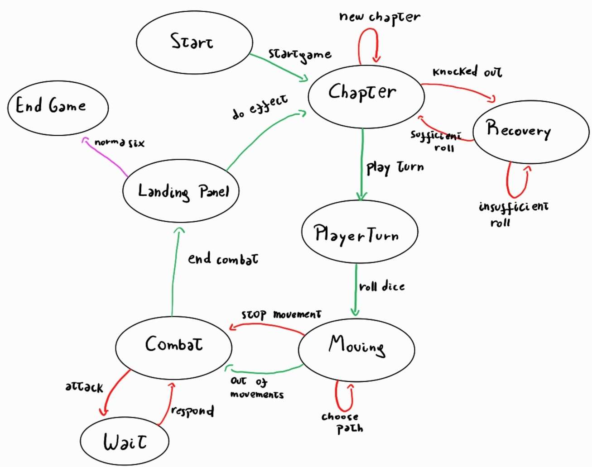

# 99.7% Citric Liquid

## About

`99.7% Citric Liquid` is a simplified clone of the renowned game, `100% Orange Juice`. Its main
purpose is to serve as an educational tool, teaching foundational programming concepts.

📢 **Note**: This project is purely educational and will not be used for any commercial purposes.

---

## For Students

The remainder of this README is yours to complete. Take this opportunity to describe your
contributions, the design decisions you've made, and any other information you deem necessary.

    

This project is licensed under the [Creative Commons Attribution 4.0 International License](http://creativecommons.org/licenses/by/4.0/).

---

## Reporte Tarea 1

Para esta primera entrega me dediqué principalmente a crear e implementar los principales traits y clases necesarias
para poder crear el juego, dado el caracter estructural de esta primera entrega no me centré tanto en los métodos de
cada clase, si bien creé algunos de no mucha complejidad que permiten cierta interacción entre clases.

### Funcionalidades
Actualmente el proyecto es capaz de crear varias instancias de paneles y conectarlos entre sí, así como unidades de 
tipo wild y player que sean contenidas en uno de estos paneles. Además, es posible crear instancias de norma que estén
asociadas a un player para posteriormente interactuar con este.

### Decisiones de diseño
- Norma: creé un Trait declarando los campos y funciones básicas del enunciado, además de una clase en que se crea con
las listas de requisitos de la norma. Decidí crear cada norma asociada a un jugador para que solo se preocupe de este 
pues me parece que a futuro será menos complicado que tener una única norma que registre datos e interactúe con todos
los jugadores
- Paneles: decidí crear un trait panel para declarar los aspectos básicos de esto del cual extiende un abstract class
que implemente los campos y funcionalidades comunes de cada panel. Define también un método activate que no hace nada el
cuál será sobreescrito por los paneles que necesiten implementar un efecto al ser activados por un player. Cada clase
fue creada con sus especificaciones necesarias y algunos métodos básicos para ir probando posibles implementaciones
- Unidades: lo principal fue crear un trait GameUnit del que extenderán todas las unidades, dividiéndose en dos posibles
traits: PlayerUnit y WildUnit. La idea de esto es dar extensibilidad al permitir que se pueda definir un nuevo tipo de
unidad extendiendo un nuevo trait de GameUnit, o una unidad del tipo más básica posible, incluso que no pueda atacar.
A grandes rasgos se conserva la clase PlayerCharacter que ahora extiende de GameUnit con unos nuevos campos necesarios 
para el juego (como el número de estrellas, victorias...) y se crea un AbstractWild del que extienden los Wilds del
enunciado

### Organización
El proyecto se divide de momento en tres packages, uno para cada punto pedido (Unidades, Norma, Paneles)

---

## Reporte Tarea 2

Para esta segunda entrega se profundizó en los métodos que hacen que las clases interactúen, además de corregir las
falencias de la tarea anterior relacionadas con el diseño de las clases Norma y la organización en paquetes del código,
además se hace uso de excepciones

### Funcionalidades
Ahora el proyecto cuenta con dos funcionalidades nuevas, un combate entre Unidades que si bien no termina de ser
un combate completo y funcional implementa correctamente a nivel atómico las distintas interacciones que se dan en un
combate, como lo son el atacar, defenderse, evadir, recibir daño, dar estrellas/victorias al ganador, etc. Además de 
las clases NormaX (numeradas de 1 a 6) que representan los niveles de progresión en el juego, las cuáles son capaces
de verificar si un jugador y subirlo de nivel siempre y cuando este cumpla los requisitos y se encuentre en un 
Home Panel para realizar el efecto Norma Check. Finalmente, se incorporan los efectos de estrellas de los paneles
Bonus Panel y Drop Panel.

### Decisiones de diseño
- Norma: además del Trait y una clase abstracta, creé 6 clases de norma, las cuáles deben recibir por parámetro el
jugador al que estarán asociadas como atributo normaClass. La idea es que a futuro el controlador se encargue de crear 
a todos los jugadores necesarios con su respectiva new Norma1. Los parámetros generales de una norma son sus requisitos
de estrellas y puntos de victoria, así como el jugador dueño. Cada clase norma que extiende de la AbstractNorma fija sus 
requisitos en el constructor además de sobreescribir la función upgrade(); esta se encarga de verificar si el jugador
cumple con alguno de los requisitos y en caso afirmativo subir el atributo norma del jugador (que es un entero) en 1,
reemplazar el atributo normaClass del jugador por una new Norma del siguiente nivel, y llamar de nuevo a la función
upgrade de player.normaClass que ahora será la nueva norma, para el caso en que el jugador pueda subir más de un nivel
en el turno. La utilidad de este diseño es que no necesita manejar listas ni arrays ni mapas para verificar qué norma
está asociada a un jugador, y en un futuro cuando se implemente el input del jugador, se le consultará a este si quiere
que su siguiente requisito sea de estrellas o de victorias y en base a eso se definirá la función upgrade de la
siguiente instancia de norma que tendrá asociada en normaClass, de esta forma no tendremos que preocuparnos de verificar
con condicionales qué clase de Norma tiene el jugador, ni buscarlo en listas. Otra ventaja de este diseño es su extensi-
bilidad pues agregar una nueva clase de norma solo sería definir los requisitos de esta en Norma6 así como la función
upgrade de Norma6, sin tener que sobreescribir nada de las clases anteriores, clase abstracta o trait.
- Combate: se implementó con double dispatch, donde el ataque de una unidad realiza la tirada de ataque y llama al 
método attackPlayer o attackWild de la unidad atacada, estós se refieren a "ser atacado por un jugador" o 
"ser atacado por un wild" respectivamente. Luego la unidad atacada procesará el ataque, en caso de ser un wild elegirá
aleatoriamente mediante una tirada de dado si defender o evadir, y en el caso del jugador se implementó un método auxi-
liar llamado simulateInput que en caso vacío retorna aleatoriamente evade o defend, en caso de ingresar uno de estos
inputs lo devolverá y en caso de ingresar un input incorrecto arroja una excepción. La idea es que a futuro efectivamen-
te se implemente un método mediante algún patrón de diseño para recibir el input del usuario y responder efectuando la
instrucción o arrojando excepción. Se utilizan métodos auxiliares takeDamage que deja KO a un playercharacter o remueve
a un wild de su tablero si llegan a recibir tanto daño que les deje con vida 0, defend, evade y demás en los combates.
Si una unidad pierde un combate le entregará a su oponente las recompensas especificadas en el enunciado de estrellas y
victorias.
- Paneles: el efecto norma check del Home Panel simplemente verifica que el jugador que lo activó se encuentre en este
panel y llama a la función upgrade de su norma class (del jugador), esto para dejar la menor responsabilidad posible
al panel, entonces la instancia norma class procederá como fue descrita anteriormente. Bonus y Drop Panel simplemente
verifican también si el jugador está en el panel y le aplican la bonificación/descuento mediante el método setter. Para
Encounter y Home Panel se tienen los métodos apply vacíos. Se espera a futuro entender cómo asociar correctamente los
métodos activate (que recupera un punto de vida) y norma check del Home Panel.
- Privacidad: en general se opta por privatizar todos los métodos posibles con private y protected, permitiendo el
acceso a estos con un método setter y en caso de ser posible la reasignación esta se hará con un setter. En todo momento
los métodos que llaman o modifican atributos de otras clases utilizan getters y setters. 

### Organización
El proyecto se sigue organizando en los mismos packages, pero ahora además el package unit tiene en su raíz el trait
y la clase común, junto a dos sub-packages más específicos para player character y wild unit. En el código en general
se prefiere especificar primero los valores y variables y finalmente los métodos.

### Patrones de diseño
De momento el único patrón utilizado es Double Dispatch, pues hay tres posibilidades para el combate que están comple-
tamente determinadas por las clases de las instancias interactuantes. El método attackWild de un wild unit (es decir,
el método que se debería llamar cuando un wild unit ataca a otro) es vacío pues estos no deberían ser capaces de pelear
entre sí según se desprende del enunciado. Esto último también se aborda con una excepción.

## Diagrama de estados

## Reporte Tarea 3

Esta tercera entrega busca avanzar en el diseño e implementación de la tercera componente del modelo MVC; el controlador

### Funcionalidades
La principal funcionalidad nueva es la capacidad de simular el flujo del juego mediante transiciones de estados. Para 
esto se definieron los principales estados necesarios para modelar cualquier potencial situación del juego y las
relaciones entre estos mediante transiciones, así dejamos la implementación necesaria para que ocurra cualquier situación
factible y esperable durante una partida de %99.7 Citric Liquid

### Decisiones de diseño
- Partida: dado el enunciado, se modeló un controlador que empieza un juego para 4 jugadores y con un único tablero para
poder simplificar el testeo, sin menospreciar la posibilidad de incorporar diversos tableros o aleatorizar estos en alguna
actualización futura, o de variar el número de jugadores de una partida.
- Diagrama de estados: se consideró como base el compartido por los profesores auxiliares mediante u-cursos pero con
ligeras modificaciones, como que la transición "Norma 6 obtenida" hacia el estado final sea desde el estado Landing Panel,
esto es más natural pues es al aplicar el efecto de un panel que un jugador puede alcanzar el nivel de Norma necesario 
para ganar una partida
- Excepciones: de momento, los inputs inválidos (por ejemplo seleccionar una opción fuera de rango) así como las 
tansiciones inválidas entre estados son tratados con excepciones para que el funcionamiento del juego sea acorde a lo 
esperado
- Transiciones: por defecto todas las funciones de transición son definidas como excepciones de transición inválida y
estas solo son reescritas como la transición correcta en los estados que corresponda. Además, es la transición la que se
encarga de realizar verificaciones de condiciones y aplicar algunas desiciones acordes, sin desmedro del controlador,
pues se me hizo más fácil de implementar. El código de la auxiliar práctica 11 sigue un desarrollo similar.
- Estados: para verificar que un estado sea de un tipo sin usar isInstanceOf, se crearon funciones booleanas que por 
defecto son definidas como un retorno "false" pero son reescritas a "true" en el estado que corresponda
- Encounter Panel...: quizás el caso más problemático fue el del encounter panel pues en la práctica su efecto es
realizar un combate entre jugador y Wild Unit, pero en general es mejor tener el estado Combat antes del estado Landing
Panel. Después de discutir con compañeros así como consultar a auxiliares y profesores, opté porque sea el Encounter
Panel en sí el encargado de realizar el combate... esto requiere que el panel reciba como parámetro al contexto? sí,
el profesor lo encontró válido para esta tarea
- Inputs...: otro problema a la hora de testear son los inputs, en general se asumen como variables que se van pasando
en cascada entre los métodos necesarios y se eligen convenientemente en los tests para probar casos importantes

### Organización
Se creó un nuevo package en main para ordenar todos los archivos relativos a la componente de modelo, pues esta debe estar
bien diferenciada del modelo

### Patrones de diseño
Se incorporaron dos nuevos patrones de diseño al modelamiento e implementación del juego los cuales se detallan:
- State: como fue descrito, modela el flujo del juego mediante estados esencialmente diferenciables pues cumplen con
distintas funcionalidades y responsabilidades durante el transcurso de la partida y transiciones apropiadas entre estos
- Observer: se utiliza el controlador como observer de los jugadores, y es notificado cuando estos llegan a un nivel de
norma 6 (en una partida esto solo puede ser por efecto del norma check de un home panel, es decir, durante un Landing
Panel State), la condición de victoria, para transicionar al EndGameState, el juego ha terminado...

# LOS MEMES HAN TERMINADO, MUCHAS GRACIAS
